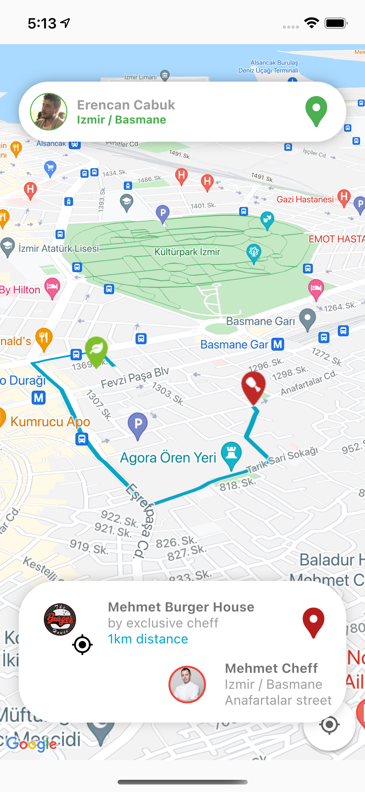

If my code is helpful to you, I really appreceiate if you buy me a coffee 🙇🏻‍☕️ 

# Quick's map

Sample Flutter project to demonstrate how to integrate Google map and drawing polyline between source and destination location.

## Getting Started

-   For the map to work you should add Google Maps API key in the following files.
    -   Under the ios folder:
        -   ios/Runner/AppDelegate.swift (add the API Key and import the Google Maps Reference)
        -   ios/Runner/Info.plist (add the missing permissions)

    -   Under the android folder:
        -   android/app.src/main/AndroidManifest.xml (add the API Key entry and permissions)

-   pubspec.yaml: 
    -   install the google_maps_flutter dependency for use google_maps
    -   install the google_maps_flutter dependency for  drawing polyline between source and destination location. 
        -   Also make sure to have the Directions API enabled on your Google Cloud Console account

[Google Maps Flutter: You can use for integration ](https://pub.dev/packages/google_maps_flutter)

# Demo view

